# LAPORAN PRAKTIKUM 3

## DAFTAR ISI
---

-[LATIHAN 1 : CODE PROGRAM BILANGAN ACAK](#latihan-1--code-program-bilangan-acak)
-[LATIHAN 2 : CODE PROGRAM INVESTASI LABA](#latihan-2--code-program-investasi-laba)
-[LATIHAN 3 : CODE PROGRAM ATM SEDERHANA](#latihan-3--code-program-atm-sederhana)
-[KESIMPULAN](#kesimpulan)
---

## LATIHAN 1 : CODE PROGRAM BILANGAN ACAK

### Step 1 : Import Random
Masukan Import Module Random diawal program :
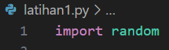

### Step 2 : Input n
Input nilai n, dengan n adalah bilangan bulat(integer) :
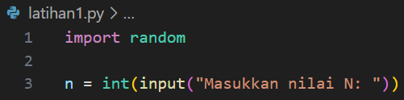

### Step 3 : Count
Seteleh itu masukan nilai count = 0 :
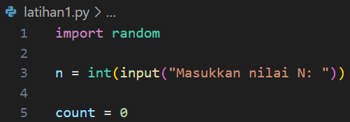

### Step 4 : Kondisi
Masukan kondisi While untuk menentukan count lebih kecil dari n, lalu input angka random dan kondisi If untuk angka lebih kecil dari 0.5 kalau angka lebih besar dari 0.5 maka count = 1, lalu print:
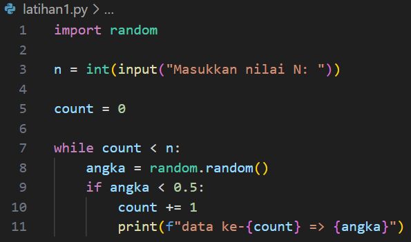

### Step 5 : Output
Print output menyatakan ("Selesai") :
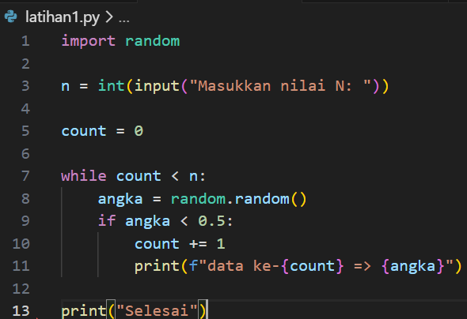

### Step 6 : Test Program
Uji code program dengan menginputkan N = 5 :
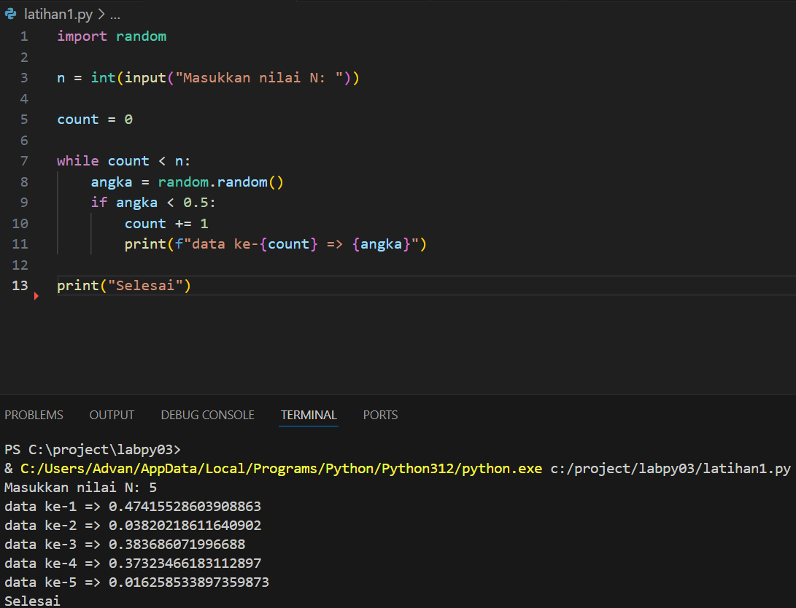

## LATIHAN 2 : CODE PROGRAM INVESTASI LABA

### Step 1 : Input Nilai Modal dan Total Laba
Input Nilai yang ingin dimasukan yaitu Modal = 100.000.000 dan Total Laba = 0
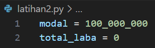

### Step 2 : Print
Print Input Modal Awal sebesar 100 juta :
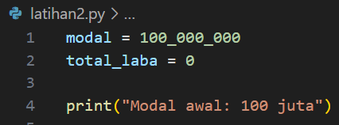

### Step 3 : Kondisi
Beri kondisi for i in range untuk jangkauan bulannya, lalu kondisi if, elif dan else untuk menentukan hasil lain, 2 bulan pertama input keuntungan laba = 0, dan di bulan ke 3&4 masukan keuntungan laba dikalikan 0.01, begitu juga dengan bulan 5 hingga 8 masukan keuntungan laba dikalikan 0.05 :
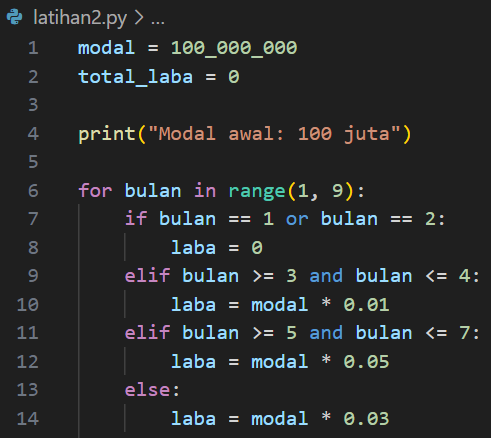

### Step 4 : Print laba bulan 1 - bulan 8
Operator += penugasan yang digunakan untuk menambah nilai pada variabel dengan nilai lain, dan menyimpan hasilnya kembali ke variabel tersebut. Dengan kata lain, += adalah cara singkat untuk menulis operasi penjumlahan dan penugasan secara bersamaan. Print output hasil dari laba perbulan, laba bulan ke berapa dan sebesar apa :
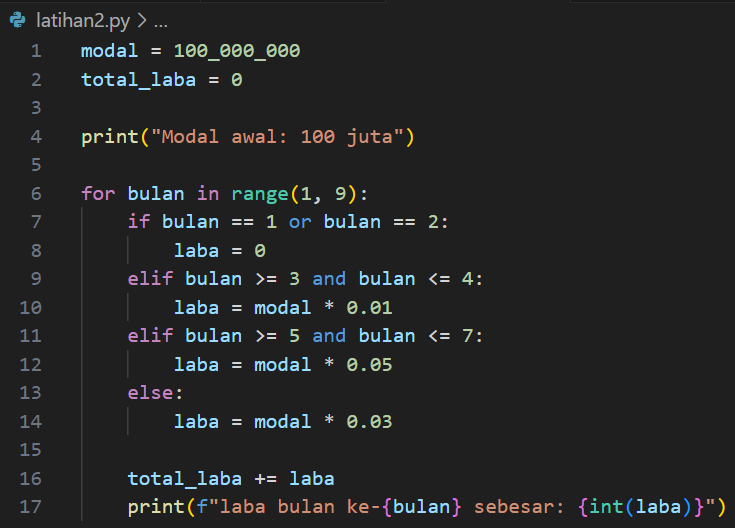

### Step 5 : Print Total
Print output total laba keseluruhan :
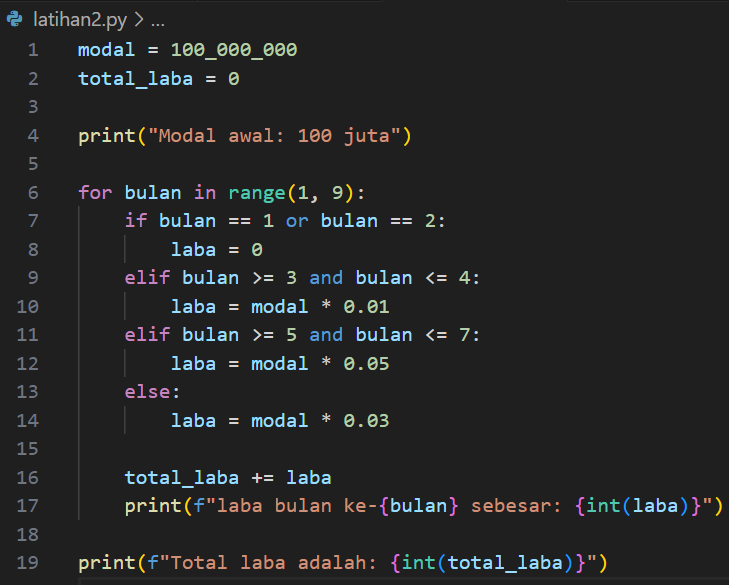

### Step 6 : Test Code Program
Uji coba code program :
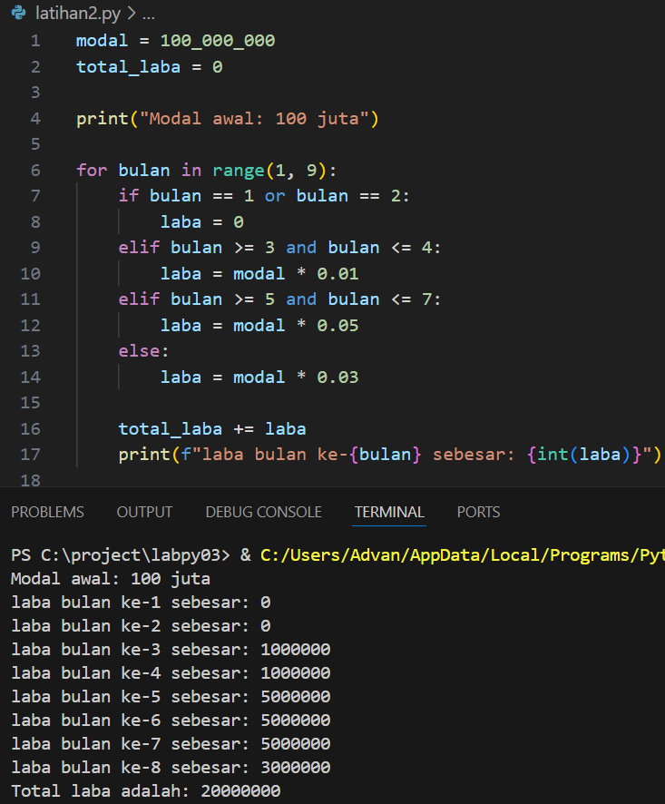

## LATIHAN 3 : CODE PROGRAM ATM SEDERHANA

### Step 1 : Input Saldo
Masukan nilai saldo di atm untuk mengambil jumlah yang dapat diambil :
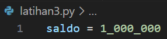

### Step 2 : Kondisi While 
Gunakan perintah Loop While untuk perulangan, masukan Saldo saat ini dan pilihan untuk menentukan penarikan atau keluar dari proses :
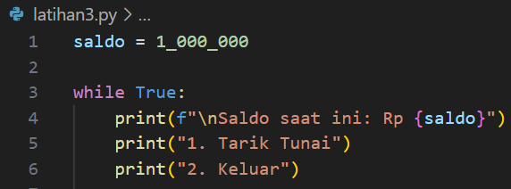

### Step 3 : Pilihan
Untuk memilih pilihan proses, input pilihan dengan mencantumkan (1/2) yang sudah tersedia :
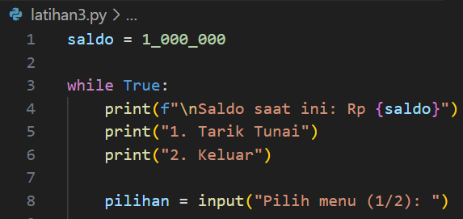

### Step 4 : Kondisi If Pilihan No.1
Beri kondisi if untuk input "pilihan" sebagai pilihan Nomer 1, input integer sebagai bilangan bulat yang akan diproses dengan memberi notifikasi "Masukan Jumlah Penarikan" :
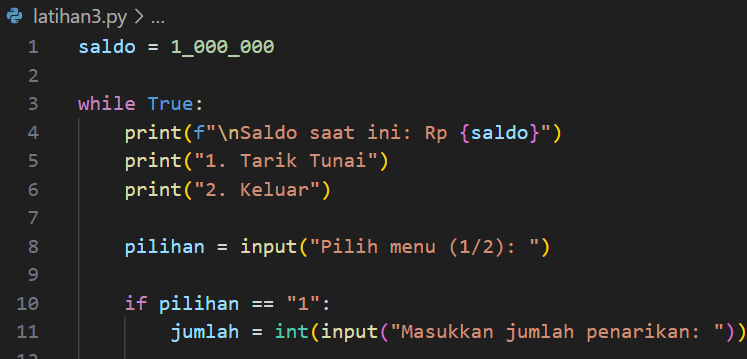

### Step 5 : Kondisi Penarikan Berhasil
Beri kembali perintah If untuk menentukan kondisi true atau valid ketika menarik sejumlah uang, jika Jumlah yang diinput lebih kecil atau sama dengan saldo maka lanjutkan dengan diberi perintah saldo dikurangi jumlah yang dimasukan, selain kondisi diatas maka saldo tidak mencukupi:
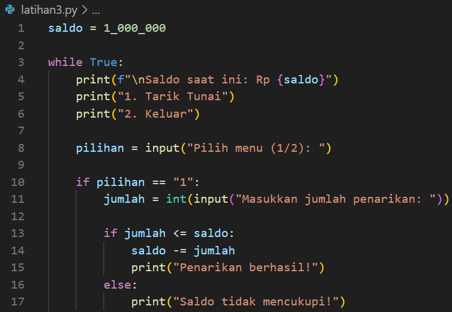

### Step 6 :  Kondisi Elif Pilihan No.2
Selanjutnya beri perintah Elif untuk kemungkinan lainnya, menyatakan keluar dari proses program, tambahkan break untuk kondisi yang sudah sesuai (Valid/True) berguna untuk tidak ada pengulangan kembali : 
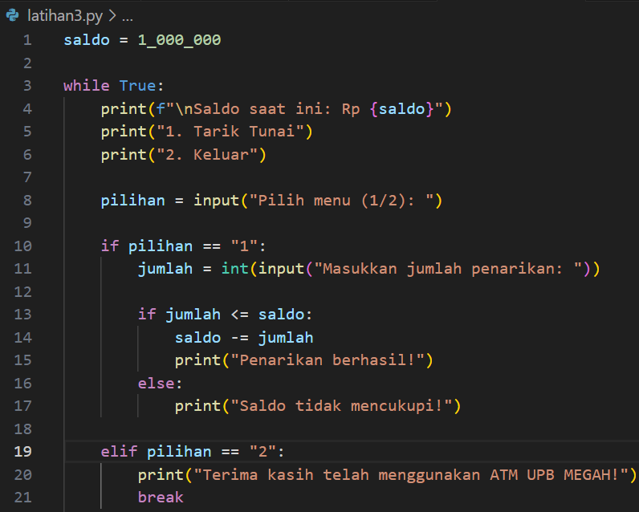

### Step 7 : Print Output
Masuk tahap terakhir, print else untuk kemungkinan lain jika kondisi data yang diinputkan False/invalid :
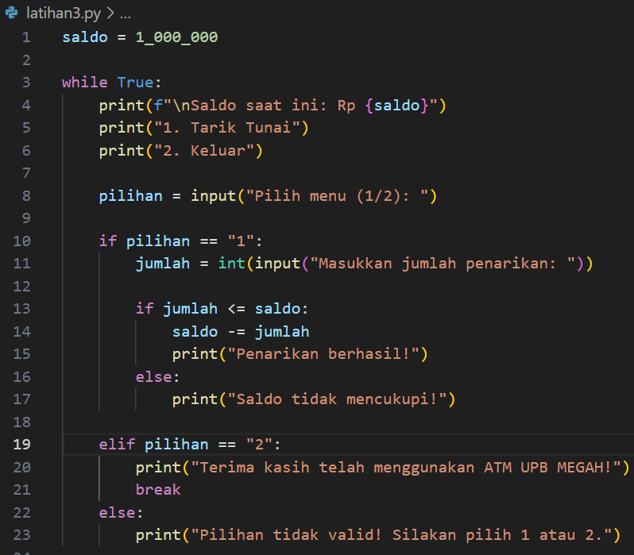

### Step 8 : Test Code Program 
Uji kode program dengan menginputkan nomer 1 untuk penarikan dan masukan jumlah uang 300.000 :
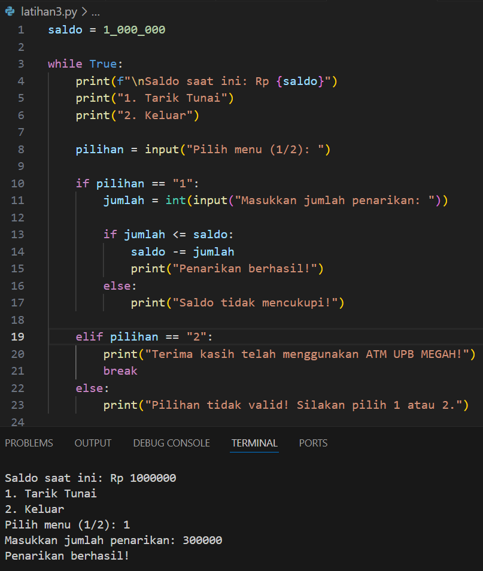

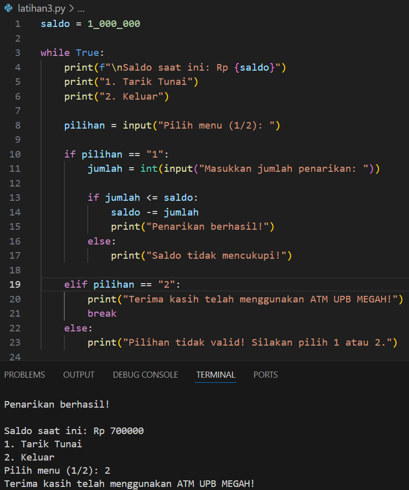

## KESIMPULAN
Code Program yang sudah dibuat dapat saya tarik kesimpulan bahwa dengan menginput perintah random maka yang akan menghasilkan output bilangan acak, dan investasi laba dapat kita permudah dengan code program yang sudah dibuat selain itu membuat ATM sederhana ini membutuhkan perintah Loop While untuk perulangan secara True/Valid, jika proses True maka beri perintah Break untuk berhentikan proses. 